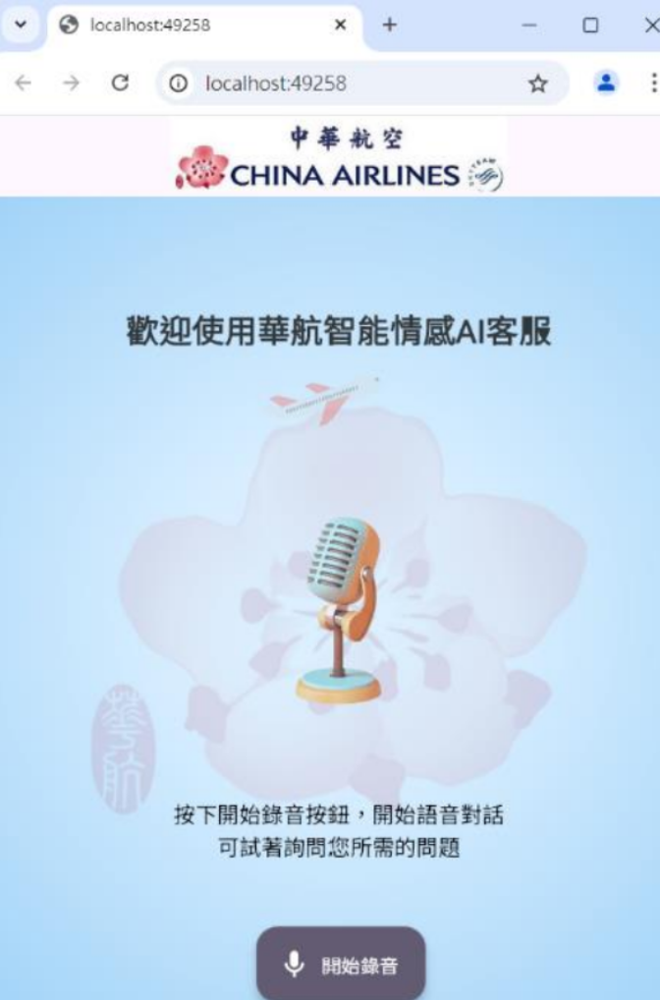
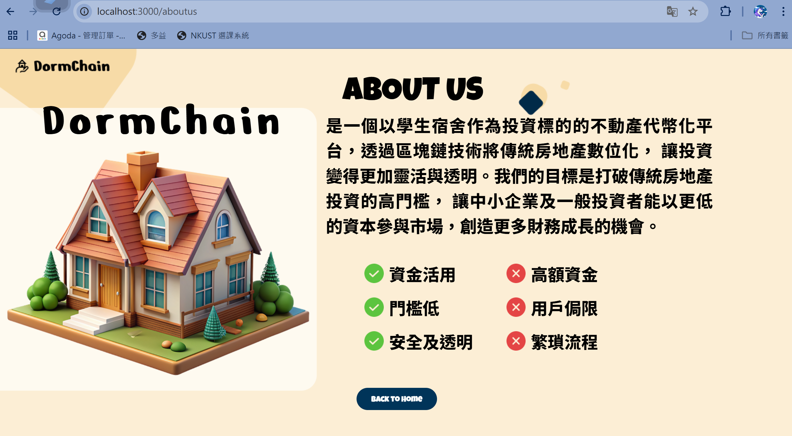
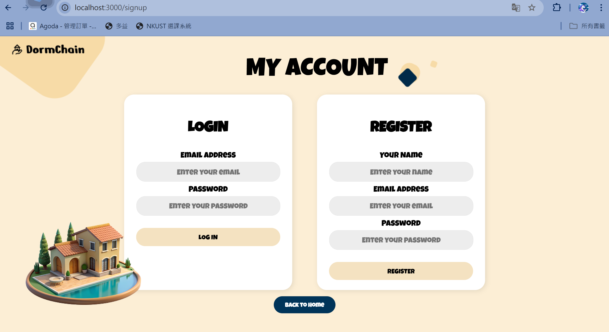
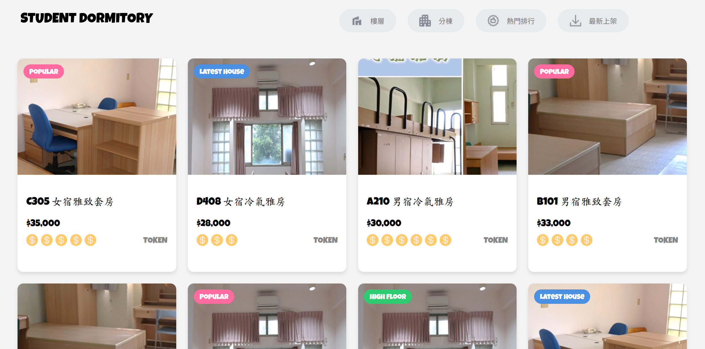
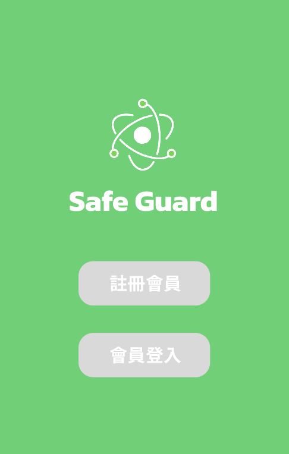

# 劉嘉欣
大家好，我叫劉嘉欣，目前就讀高科資管系三年級。我的人格特質是自我要求高與適應能力佳，對於個⼈表現、事項安排會期望⾃⼰能以最快速、如⾃我預期的⽅式進行；當我踏⼊新環境時，能快速調整⾃我狀態及⼼理適應，使⾃⼰融⼊新的環境模式中。我的人生座右銘是：「路是自己走出來的，機會是自己創造出來的。」，因此我樂於嘗試不同領域的事物，透過不斷的挑戰自我，找到屬於自己人生的道路！

## 🙋🏻‍♀️ 基本資料
🏫 就讀校所：高雄科技大學 資訊管理系  
📧 電子郵件：liuchiasin100@gmail.com  
📱 手機號碼：0902278618  
🏠 居住地址：台中市北區  

## 📚 學習經歷
- **榮護2024全國創新跨界共創⽐賽第三名-以中華航空企業做為主題發想**  
本次競賽中，為解決中華航空所⾯臨之⼈⼒不⾜、全時段服務等痛點，本團隊深入探討旅客在不同情境下的需求、圖表分析、情境模擬等，發想出一套情感偵測語⾳系統，提出應對⽅針並實際開發系統測試，有效提升旅客體驗及品牌忠誠度。  
*在本團隊中負責主題發想、痛點分析、計畫書撰寫及系統功能發想。  
[🔗 比賽企劃書](https://drive.google.com/file/d/1ZmGYthtCAfULIYbZp2qIOl3nOWIhgSv4/view?usp=sharing)

 

- **專題研究實務-研究台灣不動產代幣化可⾏性分析  以學校宿舍為例**  
⽬前完成研究計畫書及系統流程架構。本研究最終成果將架設平台並以學校宿舍為不動產投資物進⾏分割，透過區塊鍊及虛擬代幣，使投資者透過交易買賣形成智能合約，⾃動匯⼊代幣⾄電⼦錢包。  
*在本團隊中擔任組長，負責計畫書撰寫、前端網頁設計與開發、進度安排以利專題如期完成。以下是專題內容及前端網頁展示專區⬇️    
[🔗 實務專題專區](https://drive.google.com/drive/folders/1osVfeFyky6spRT9Jcku5rapmOE0KNHj9?usp=sharing)  
[🔗 figma 設計](https://www.figma.com/design/aBYkTw1CAeQ5qZAnMn0lZa/DormChain?node-id=0-1&t=M4433iyXNgrN39Pa-1)

      
 

- **修讀CCNA證照班**  
為更深⼊了解網路應⽤、IP通訊、資訊安全等相關知識領域，我於⼤三修讀了這⾨課程，透過實際上機操作及課堂解說以更專業的學習環境鍛鍊⾃我，預計於本學期6⽉進⾏證照考試。

## 🎖️ 專業證照
- 2024-iPASS資訊安全⼯程師 初級
- 2024-⾦融常識與職業道德
- 2023-ERP軟體應⽤師
- 2020-會計丙級證照
- 2020-會計專業認證
- 2020-ERP基礎檢定術科證照

## ✅ 個人技能
- 程式語言：Python, Javascript, C
- 前端開發：HTML, CSS, React, figma
- 其他領域：Github, Cisco, ERP, Accounting

## 📌 其他作品
**防詐騙APP - figma設計**  
這是我初次接觸figma並自己完成的第一個作品。在學習及嘗試過程中，我覺得最大的挑戰是要如何讓頁面呈現出加分的動態效果，以及如何設計出簡單明瞭又能夠凸顯功能特色的視覺頁面，而在我多次嘗試與調整後，順利完成了這個作品。  
[🔗 file連結](https://www.figma.com/design/EdYSxCW2jZAr3iFzgMjqnJ/app?node-id=7-58&t=Qe08o9vdZEw9TuX4-1)  
[🔗 prototype連結](https://www.figma.com/proto/EdYSxCW2jZAr3iFzgMjqnJ/app?page-id=0%3A1&node-id=7-58&viewport=460%2C162%2C0.15&t=nl6K9y5Et4xy7Z16-1&scaling=scale-down&content-scaling=fixed&starting-point-node-id=9%3A58)   

